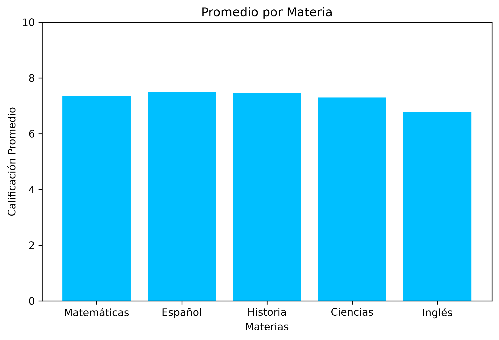
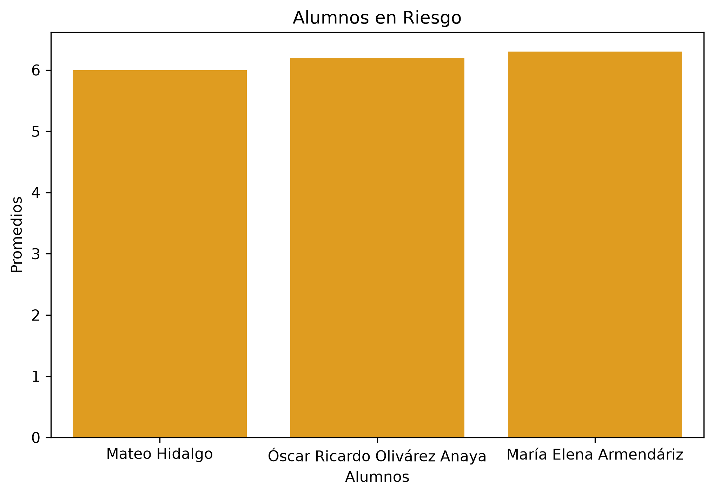
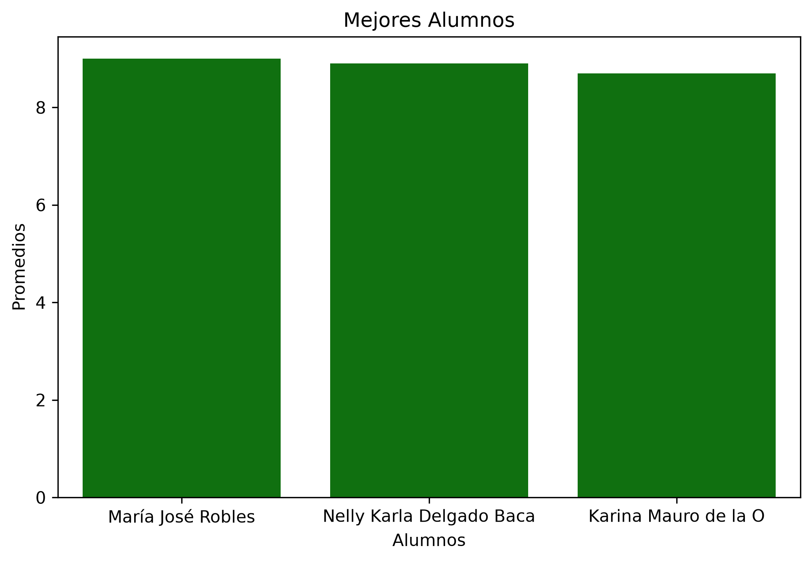

# 📊 Análisis ETL de Calificaciones

## Descripción

Este proyecto desarrolla un proceso ETL (Extract, Transform, Load) para el análisis de calificaciones de estudiantes utilizando Python.

El objetivo es transformar datos académicos en información útil mediante técnicas de transformación, análisis y visualización de datos.

---

## Herramientas Utilizadas

- Python
- Pandas
- Funciones Lambda
- Matplotlib
- CSV

---

## Proceso ETL

### Extracción 

Se cargó un archivo CSV que contiene información de estudiantes y sus calificaciones.

Principales campos analizados:

- Estudiantes
- Materias
- Elementos a calificar (Promedio Materias,Tareas, Asistencia, Puntualidad)
- Calificaciones

### Transformación 

- Creación de nuevas columnas para ponderar los elementos que se califican mediante funciones Lambda.
- Calculo de promedio final
- Clasificación de estudiantes → Aprobados y Reprobados.
- Generación de métricas para el análisis posterior.

### Cargar

- Creacipon de archivo de salida con dataframe resultado

  

  

  

